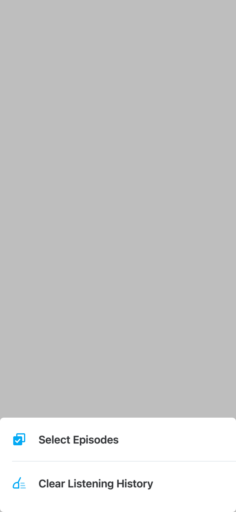
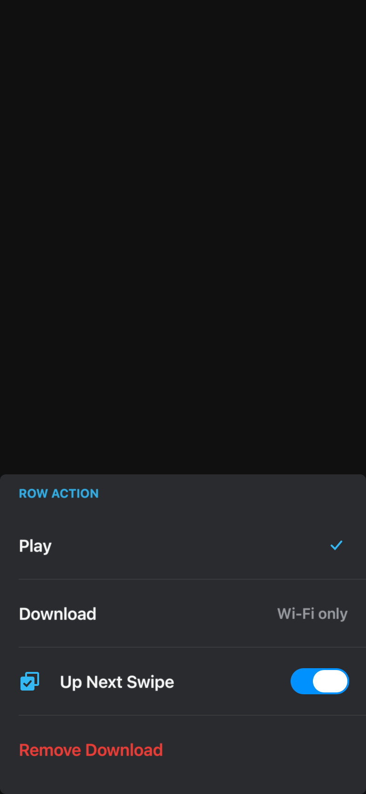
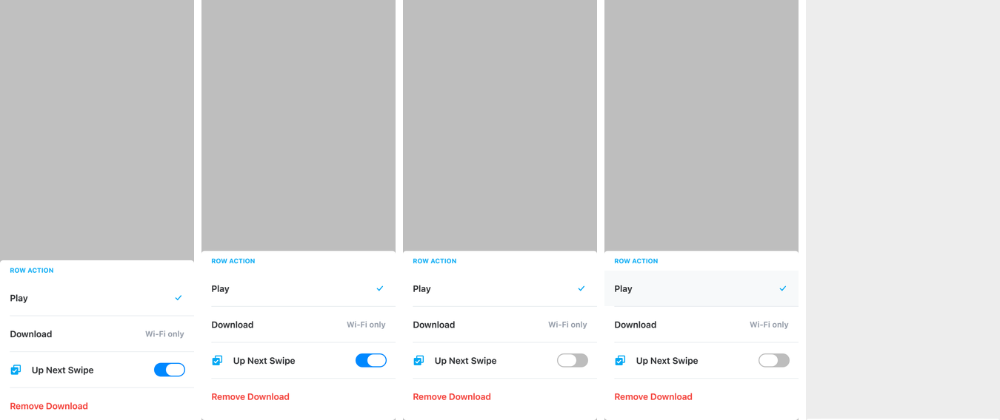

# Running a real app's screen — the definition-of-done experiment

**Question:** can a screen from a real, shipping, open-source UIKit app be
compiled against OpenUIKit *as written* and rendered — headless, live, and
identically on Linux?

**Answer: yes, for the screen tested, at 97.7 % of its source unmodified.**
14 of 605 vendored lines had to change, and this file says exactly which 14
and why. It also says what the experiment did **not** prove, which is more
interesting than what it did.

---

## What was attempted

**App:** [Automattic/pocket-casts-ios](https://github.com/Automattic/pocket-casts-ios)
at `ddf27e6` (MPL-2.0). 1,690 Swift files; one of the four apps in the
`Tools/apicensus` corpus.

**Screen:** the **options picker** — the bottom sheet Pocket Casts puts up
from a "..." button, used on ~20 screens (Listening History, Up Next, General
Settings, the player shelf, Uploaded Files, …). Four source files, 605 lines:

| file | lines | what it is |
|---|---|---|
| `podcasts/OptionsPickerRootController.swift` | 258 | the sheet's `UIViewController`: a `UIScrollView` + `UIStackView` built entirely in code, self-sizing through `UISheetPresentationController` detents |
| `podcasts/SimpleActionView.swift` | 228 | one row: icon, label, optional secondary label, optional `UISwitch` or tick, tap gesture, press highlight |
| `podcasts/OptionsPicker.swift` | 83 | the presenter |
| `podcasts/OptionAction.swift` | 36 | the model for one row |

It was chosen for three reasons, all of which matter to the honesty of the
result:

1. **It is code-based.** No storyboard, no xib, no `@IBOutlet` — the explicit
   non-goal in docs/APP_COMPAT.md.
2. **It has no third-party dependencies at all.** All four files import only
   `UIKit` (and `Foundation`, for nothing). So the shim file below contains
   *zero* stand-ins for RxSwift/SnapKit/etc. — every shim is the app's own
   infrastructure. What is being tested is the UIKit surface and only that.
3. **It is dense in the things the census says apps actually do**:
   `UIStackView` + `NSLayoutConstraint` anchors, `UIScrollView`'s
   `contentLayoutGuide`/`frameLayoutGuide`, `layoutMarginsGuide`,
   `safeAreaLayoutGuide`, `systemLayoutSizeFitting`, `UIFontMetrics`,
   `UISheetPresentationController` custom detents, `#selector` target-action,
   `UIImage(named:)`, `registerForTraitChanges`, content hugging /
   compression resistance, `touchesBegan` highlighting.

Selecting one screen out of one app is a **sample of size one**. Everything
below is a measurement of that sample, not a claim about apps in general.

---

## What rendered

Headless, `openrender realapp` (three configurations, 393×852 @2×):

|  |  |  |
|---|---|---|
| `realapp_history_light` — the Listening History "..." menu, transcribed from `ListeningHistoryViewController.swift:234` | `realapp_settings_light` — a titled picker exercising the tick, the secondary label, the `UISwitch` row and the destructive row | `realapp_settings_dark` — the same in the app's dark theme |

Live, `openhost --app pocketcasts --script scripts/realapp_interaction.json`
(five of the ten recorded frames; each interaction is the app's own code
running):



*0.20 s the sheet is mid-slide (the app calls `present(animated: true)`);
0.85 s at rest; 1.30 s the `UISwitch` has flipped — a touch went through
`UIControl.addTarget` and `Selector.named("switchToggled:")` into the app's
method; 1.95 s the Play row is filled with `#F7F9FA`, which is
`ThemeColor.primaryUi01Active` set by the app's `touchesBegan` override
arriving through `UIScrollView.delaysContentTouches`; 2.30 s the sheet is
gone, because releasing that press fired the app's `actionTapped`, which
called its own `animateOut(optionChosen:)`.*

Linux: `scripts/linux_realapp_verify.sh` builds the library, `openrender`,
`openhost` **and the vendored app source** inside a stock `swift:6.2-noble`
container, renders the three headless configurations, replays the scripted
interaction, and diffs all of it against this machine's macOS run.

```
==> build (library + openrender + openhost + RealAppProbe)
    built clean -- the vendored app source compiles off Darwin
  headless: byte-identical 3/3
  live:     byte-identical 10/10
byte-identical: 13/13
REAL-APP SCREEN VERIFIED ON LINUX
```

**Nothing here is oracle-goldened.** There is no real-UIKit golden of this
screen and there cannot be one without building Pocket Casts, so the render
is *plausible*, not *proven*. What IS proven against real UIKit is every
primitive underneath it — the 108 fixture scenes, and the new measurements in
`Tests/OpenUIKitTests/DynamicTypeTests.swift`, which replay
`Tools/oracle2/dyntypeprobe` and `Tools/oracle2/detentprobe` numbers taken on
real iOS 26. Two divergences are visible in the pictures above and are listed
under "Where the render is wrong".

---

## The adaptation ledger

This is the number the experiment exists to produce. Vendored sources are in
`Sources/RealAppProbe/Vendored/`; every change carries an `ADAPTED(reason)`
comment at the site.

| file | original lines | lines removed or changed | unmodified |
|---|---|---|---|
| `OptionsPickerRootController.swift` | 258 | **0** | 100 % |
| `SimpleActionView.swift` | 228 | 8 | 96.5 % |
| `OptionsPicker.swift` | 83 | 1 | 98.8 % |
| `OptionAction.swift` | 36 | 5 | 86.1 % |
| **total** | **605** | **14** | **97.7 %** |

The 258-line view controller — the actual *screen*, and the file with all the
Auto Layout in it — compiles **byte-identically**.

### The 14 lines, by reason

| reason | lines | detail |
|---|---|---|
| **`NSCoder` / Foundation collision** | 5 | `required init?(coder:)` deleted (4 lines) and `import Foundation` dropped (1). `NSCoder` is a Foundation type, and a target that links OpenUIKit cannot `import Foundation` at all without Foundation's `CGRect`/`CGSize` colliding with OpenUIKit's. The initializer is `@available(*, unavailable)` in the original and never runs — but it is *present in essentially every UIKit class*. |
| **`@MainActor` isolation** | 4 | `OptionAction`'s `action` and `submenu` closure types and its two initializers are declared `@MainActor`. Real UIKit annotates `UIView`/`UIViewController` `@MainActor`, so calling such a closure from a touch handler is legal. OpenUIKit's classes carry no global-actor isolation, so the same call is a concurrency error. Annotation dropped; the library is single-threaded either way. |
| **`#selector` / `@objc`** | 4 | Two `#selector(…)` call sites rewritten to `Selector.named(…)`; two `@objc private func` declarations lost their `@objc` and their `private`, and the 1-argument action's sender retyped `UISwitch` → `AnyObject`. Exactly the cost docs/OBJC_RUNTIME.md predicted. |
| **harness plumbing (not a UIKit gap)** | 1 | `class OptionsPicker` → `public class OptionsPicker`, so `openrender` can reach it across the module boundary. Inside a real app target this would not be needed. |

Notice what is **not** in that table: no missing method, no renamed property,
no restructured layout, no removed feature. Every one of the 14 lines is a
*language/runtime* incompatibility, not an API-surface hole. That is a
different and better failure mode than the census's "missing type" counting
suggests — but see "the code that was written *around* it", below.

### The code written around it (this is the real cost)

Unmodified app source is not the whole bill. Three files exist that a real
UIKit build would not need:

| file | lines | why |
|---|---|---|
| `Sources/RealAppProbe/Shims.swift` | 207 | the app's own infrastructure: its 11-theme colour system (`Theme`, `ThemeColor`, `AppTheme` — ~2,200 real lines collapsed to two themes, with **the exact hexes from the app's own `scripts/themes/theme.csv`**), its `UIFont.font(ofSize:weight:scalingWith:)` helper, `UIImage.tintedImage`, `UIView.updateSizeConstraints`, a `LiquidGlass` feature flag pinned off, and two empty sibling row classes. **No shim in this file stands in for a UIKit symbol** — that rule is stated at the top of the file, because shimming UIKit would make the measurement circular. |
| `Sources/RealAppProbe/SelectorTables.swift` | 23 | the `SelectorDispatching` conformance `SimpleActionView` cannot supply for itself. Two lines plus one per action, for **one** class. Real UIKit needs zero. |
| `Sources/UIKitShim/UIKit.swift` | 16 | a module literally named `UIKit` that does nothing but `@_exported import OpenUIKit`, so the vendored files keep `import UIKit` verbatim. Counted as a shim; it hides four lines of adaptation that say nothing about API coverage. |

Plus `Sources/RealAppProbe/RealAppScreen.swift` (121) and
`Sources/openrender/RealApp.swift` (81), which are harness, not app.

So: **605 app lines, 14 changed, 246 lines of scaffolding** (shims + selector
table + module alias). Scaled up, the scaffolding is the thing that would
hurt: the selector table is ~3 lines per action class, and the theme shim
would have to become the app's real theme system (which would compile — it is
plain Swift — once `NSCoder`/Foundation stops being a problem).

---

## What had to be built to get here

Everything the compiler asked for that was a genuine UIKit gap was
implemented rather than shimmed. All of it is *members of types OpenUIKit
already exported* — the gap docs/APP_COMPAT.md flags as under-measured, now
measured by a compiler instead of a regex.

| built | why the app needed it | oracle |
|---|---|---|
| `UIFont.TextStyle`, `UIContentSizeCategory`, `UIFont.preferredFont(forTextStyle:)`, `UIFontDescriptor.preferredFontDescriptor(withTextStyle:)`, **`UIFontMetrics`** | every label goes through the app's `UIFont.font(ofSize:weight:scalingWith:)` | **`Tools/oracle2/dyntypeprobe`** on real iOS 26: 11 styles × 12 categories × 19 base values → `Sources/OpenUIKit/Resources/dynamic_type.json`. Raw dump kept at `fixtures/realapp/dynamic_type_ios.json`. |
| `UISheetPresentationController.detents` + `.large()`/`.medium()`/`.custom(resolver:)` + the resolution context; `UIModalPresentationStyle.formSheet` | the sheet sizes itself to its content | **`Tools/oracle2/detentprobe`** on real iOS 26, 13 cases → `fixtures/realapp/detents_ios.json`. `maximumDetentValue` (759 on a 393×852 window = height − 59 − 34) and the over-maximum collapse to the `.large` frame are exact. |
| `UIScrollView.contentLayoutGuide` / `frameLayoutGuide`, wired into the cassowary solver so constraints against the content guide *drive* `contentSize` | the picker is a scroll view sized by its stack | covered by the existing scroll fixtures + new unit tests |
| **`UIStackView` composing with Auto Layout**: `addArrangedSubview` clears `translatesAutoresizingMaskIntoConstraints` (as UIKit does), a row's own size constraints are honoured as content, and the solver no longer overwrites arranged-subview frames | without it every row collapsed to height 0 and the sheet was 12 pt tall | the 108 fixture scenes and the existing stack tests are the regression bar; `testFillNestedStackIsFlexible` caught a real over-reach and constrained the fix |
| `UIView` `Equatable`/`Hashable` (identity), `systemLayoutSizeFitting(_:withHorizontalFittingPriority:verticalFittingPriority:)`, `layoutFittingCompressedSize`/`ExpandedSize`, `registerForTraitChanges`, accessibility storage; `UILabel.adjustsFontForContentSizeCategory`; `UIImage.draw(in:)`/`draw(at:)` | `if previousView != label`, `preferredSheetHeight`, `registerForTraitChanges`, `isAccessibilityElement`, image tinting | unit tests |
| **nine classes made `open`** (`UISwitch`, `UIStackView`, `UISlider`, `UISegmentedControl`, `UIProgressView`, `UIPageControl`, `UIRefreshControl`, `UIActivityIndicatorView`, `UISearchTextField`, `UIPanGestureRecognizer`) | `class ThemeableSwitch: UISwitch` did not compile | — |

Gates after all of it: `swift build` clean, **108/108 fixture scenes**,
**9/9 scroll traces**, **732 tests** (711 → 732), 0 failures.

---

## Blocked on — ranked

Ranked by how much of the corpus each one would touch. Counts are
`grep -rIo --include="*.swift"` over all four corpus apps (5,099 Swift files),
run 2026-08-25; the method over-counts comments and dead code, like the rest
of the census.

| # | blocker | corpus reach | what it costs today |
|---|---|---|---|
| 1 | **`@objc` / `#selector` and the dispatch table** | `#selector` **1,138 uses / 360 files**; `@objc` **1,189 / 395** | Known and documented (docs/OBJC_RUNTIME.md). Measured here at 4 changed lines + a 23-line table for one class. Nothing can close it without an ObjC runtime; what *could* shrink it is a macro that generates `SelectorDispatching` from `@objc`-looking declarations. |
| 2 | **Foundation cannot be imported alongside OpenUIKit** | `NSCoder` **379 / 344**; and every app file that says `import Foundation` at all | The single biggest structural obstacle to compiling an app *as a whole*. `required init?(coder:)` alone is in 344 files. Fixing it means either `typealias`-ing OpenUIKit's CG types to Foundation's on Darwin/`swift-corelibs` (giving up the "no Foundation" property at the app boundary, not in the library), or shipping an `OpenUIKitFoundationCompat` module that re-exports the non-colliding half. |
| 3 | **No `@MainActor` isolation on OpenUIKit's classes** | `@MainActor` **641 uses / 270 files**, and rising — Swift 6 language mode makes it the default expectation | 4 of this sample's 14 changed lines. Annotating `UIView`/`UIViewController`/`UIControl` `@MainActor` is mechanical but touches the whole library and every host; it is the cheapest large win on this list. |
| 4 | **No asset catalog** | `UIImage(named:)` **438 / 161** | `UIImage(named:)` resolves loose `@2x`/`@3x` files only. Real apps ship `.xcassets`, which also carry the template-rendering-intent flag the app's tinting depends on. The harness copies three PNGs into `fixtures/realapp/assets/` and renames one (`small-tick` is stored as `tick@2x.png` inside its imageset). A `.xcassets` reader is a small, self-contained project. |
| 5 | **`UIWindow` runs no appearance transition** | `viewDidAppear` **119 / 105** | `makeKeyAndVisible()` does not call `viewWillAppear`/`viewDidAppear` on the root controller, so app code that starts work there never runs. The harness works around it with an explicit `presentPickerNow()`; both `openrender` and `openhost` had to do it. This is a small fix and should be one. |
| 6 | **Localization** | `L10n.` **3,400 / 540** | Not UIKit — but every user-visible string in three of the four corpus apps goes through a generated `L10n` enum backed by `NSLocalizedString`/`Bundle`. Any whole-app attempt hits it immediately. The harness passes literals. |
| 7 | **`UIVisualEffectView` / `UIBlurEffect`** | 20 / 11 | The standing divergence since M12. Not needed by this screen (the app's `LiquidGlass` flag is off below iOS 26), but it is the reason the sheet platter, alerts and bar buttons are flat. |
| 8 | **`UIFontMetrics` away from the default category** | `UIFontMetrics` 66 / 48 | Exact at `.large` and at all 228 probed (style, category, base) points; linearly interpolated between them, where real UIKit's curve is piecewise with ⅓-pt quantization. Worst case ~⅔ pt at accessibility sizes. Widening `baseValues` in the probe closes it. |
| 9 | **iOS-26 floating sheet card** | — | Below the maximum detent, iOS 26 draws the sheet as a card inset 8 pt on each side and 8 pt off the bottom, scaled by 377/393. OpenUIKit draws it edge-to-edge at the correct *height*. The probe measured it (`fixtures/realapp/detents_ios.json`); the geometry does not decompose into an inset plus a height without also modelling the transform, so it was left. **Visible in the screenshots above.** |
| 10 | **Accessibility is storage only** | `isAccessibilityElement`, `accessibilityTraits` etc. | Values round-trip; nothing consults them. Fine for rendering, not for a UI test that queries the accessibility tree — which is the obvious next use for a UIKit reimplementation. |
| 11 | **`registerForTraitChanges` needs a host to fire it** | — | Registrations are stored and `_traitsDidChange(previous:)` delivers them, but nothing in OpenUIKit changes the content size category on its own. |
| 12 | **`UIStackView` is still a frame layout** | — | It now *composes* with Auto Layout (rows sized by their own constraints, stack reports a fitting size, solver defers to it), but it does not generate the constraints UIKit's does. A stack whose arranged subviews are positioned by constraints *relative to each other* would not work. |
| 13 | **xibs / storyboards** | `@IBOutlet` **1,678 / 323** | Explicit non-goal, restated because it is the reason 323 of 5,099 files are out of reach by construction — including the sibling `MultiSelectFooterView` in this very app. |

---

## Where the render is wrong

Stated up front because the screenshots look better than the fidelity claim:

1. **The sheet is edge-to-edge; iOS 26's is a floating inset card.** Item 9
   above. The *height* is right (content + bottom safe area, pinned to the
   bottom); the shape is not.
2. **No blur anywhere.** The sheet platter is a flat fill.
3. **`.SFUI` vs `.SFNS`.** The harness selects the iOS cut of San Francisco
   (`OpenUIKitRuntime.systemFontCut = .iOS`), the same route the alert and bar
   fixtures use, so advances match real iOS below 20 pt.
4. **No golden.** As stated above — there is no real-UIKit render of this
   screen to diff against.

---

## Verdict

**How far is OpenUIKit from running real apps?**

*Rendering* a real code-based screen: **arrived, for this class of screen.**
The screen's own layout code — 258 lines of `UIScrollView` + `UIStackView` +
anchors + guides + a self-sizing sheet — compiled and laid out with zero
edits, and the result is byte-identical on Linux. That is a stronger result
than the census's 96.3 % "effective coverage" predicted, because the census
counts *types* and the things that actually broke were *members* and
*language features*.

*Compiling a whole app*: **not close, and the reasons are now specific rather
than vague.** In descending order of impact they are Foundation
interoperability (item 2), selector dispatch (item 1), `@MainActor` (item 3),
asset catalogs (item 4) and xibs (item 13). None of those is about UIKit's API
surface. Three of the five are one focused project each; the fifth is out of
scope on purpose. A useful next milestone is therefore not "more UIKit types"
— it is **`import Foundation` alongside OpenUIKit**, which would let the app's
own model layer, theme system and string tables compile untouched, and would
delete `Shims.swift` entirely.

*Caveat on the whole thing*: one screen, one app. The next screen would find
different holes. `Sources/RealAppProbe` is set up so adding a second one is
cheap, and that is the way to make this number mean something.

---

## Reproducing

```sh
# headless
swift build -c release --product openrender
OPENUIKIT_BACKEND=quartz ./.build/release/openrender realapp out_realapp

# live (SDL2 window; add --script/--record for the deterministic capture)
swift build -c release --product openhost
OPENUIKIT_BACKEND=quartz ./.build/release/openhost --app pocketcasts
OPENUIKIT_BACKEND=quartz ./.build/release/openhost --app pocketcasts \
    --script scripts/realapp_interaction.json --record out_host_realapp

# Linux byte-identity (Docker)
scripts/linux_realapp_verify.sh

# re-take the oracle measurements (iOS Simulator)
scripts/dyntype_probe_sim.sh <outdir>
scripts/detent_probe_sim.sh  <outdir>
```

The app checkout is not vendored. `git clone https://github.com/Automattic/pocket-casts-ios`
and compare `Sources/RealAppProbe/Vendored/` against `podcasts/` to audit the
14-line ledger yourself.
