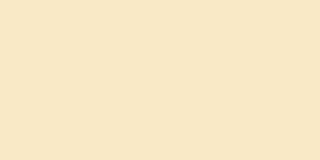
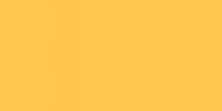
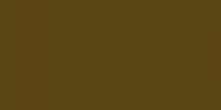
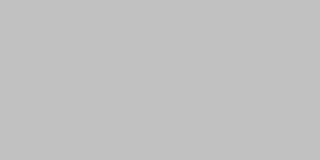

# iOS 26.1 materials (UIVisualEffectView / UIBlurEffect / UIGlassEffect)

Oracle: `/tmp/materials-probe` on **iPhone SE 3rd gen 2x / iOS 26.1**
(`SIM_DEVICE_SUFFIX=-uikit-materials`, device `OpenUIKit-2x-uikit-materials`).
Six uniform backdrops behind a 120×80 pt `UIVisualEffectView` (and a
`UITabBar` over the same backdrops). Interiors are the 2x PNG centre pixel.
CAFilter dumps from the live layer tree. Nothing here is fitted to a
comparison score.

Guard in the port: `OpenUIKitRuntime.systemFontCut == .iOS`. Catalyst keeps
the historical radius-20 gaussian with no tint.

There is **no** `UIView.glassEffect` in UIKit headers (iOS 26.1
`UIGlassEffect.h`). SwiftUI `.glassEffect` already exists; this table is the
UIKit effect-object / visual-effect-view path.

## UIGlassEffect API (header, not the thin swiftinterface)

| item | measured |
|---|---|
| `Style.regular.rawValue` | 0 |
| `Style.clear.rawValue` | 1 |
| `init()` / `init(style:)` | distinct objects; NSObject **identity** equality |
| `copy()` of glass | **new** object, same `isInteractive` / `tintColor` |
| `UIGlassContainerEffect.copy()` | **self**; default `spacing` 0 |
| `isInteractive` at rest | interiors byte-match non-interactive |

## Classic `UIBlurEffect` (CAFilter)

Pipeline: `gaussianBlur` → `colorSaturate` 1.8 → source-over overlay
(`_UIVisualEffectSubview.backgroundColor`). Saturation is **clamped to
`[0, alpha]` before the overlay** (yellow B goes negative; extraLight still
matches (249, 233, 198)).

| style | σ (pt) | sat | overlay |
|---|---|---|---|
| extraLight / prominent | 20 | 1.8 | rgba(0.97, 0.97, 0.97, 0.80) |
| light / regular (light) | 30 | 1.8 | rgba(1, 1, 1, 0.30) |
| dark / regular (dark) | 20 | 1.8 | rgba(0.11, 0.11, 0.11, 0.73) |

### Interiors (centre, Δ ≤ 1 on gray; chroma as sampled)

Backdrop RGB: white 255, black 0, gray33 51, red (255, 56, 60),
yellow (242, 179, 64), green (52, 199, 89).

| style | white | black | gray33 | red | yellow | green |
|---|---|---|---|---|---|---|
| extraLight / prominent | 249 | 198 | 208 | 249,202,204 | 249,233,198 | 198,244,204 |
| light / regular | 255 | 77 | 112 | 255,92,97 | 255,199,77 | 77,238,99 |
| dark | 89 | 20 | 34 | 89,26,28 | 89,68,20 | 20,83,29 |

## System materials (CAFilter)

`luminanceCurveMap` + `colorSaturate` + `colorBrightness` + `gaussianBlur`.
No overlay subview. LUT `inputValues` is not in the dump. Gray interiors
are the two-unknown mix `out = (1−α)·sat(B) + α·T` from white/black plus
the dumped radius and saturation. Chrome / ultraThin chroma residuals are
named below — not retuned to a score.

| style | σ | sat | white | black |
|---|---|---|---|---|
| ultraThin (light) | 22.5 | 1.1 | 245 | 88 |
| thin (light) | 29.5 | 1.35 | 245 | 142 |
| material (light) | 29.5 | 1.5 | 245 | 197 |
| thick (light) | 45 | 1.5 | 245 | 232 |
| chrome (light) | 22.5 | 1.1 | 247 | 178 |
| ultraThin (dark) | 22.5 | 1.1 | 177 | 31 |
| thin (dark) | 29.5 | 1.35 | 125 | 31 |
| material (dark) | 29.5 | 1.5 | 83 | 31 |
| thick (dark) | 45 | 1.5 | 37 | 31 |
| chrome (dark) | 22.5 | 2 | 87 | 18 |

Light appearance `system*Material` without a Light/Dark suffix matches the
`*Light` row; dark appearance matches `*Dark`. Adaptive `.regular` follows
the classic light/dark overlay table, not this mix.

Chroma samples (light, centre):

| style | red | yellow | green |
|---|---|---|---|
| ultraThin | 237,128,131 | 237,201,139 | 130,212,151 |
| thin | 255,167,168 | 252,218,156 | 153,233,174 |
| material | 255,201,203 | 255,236,192 | 192,246,206 |
| thick | 255,232,232 | 255,245,224 | 225,252,232 |
| chrome | 255,215,217 | 255,253,221 | 220,255,231 |

The two-unknown gray mix plus dumped sat does **not** recover ultraThin /
chrome chroma (max channel Δ ~19–31). Dark `systemMaterial` over gray33 is
50 vs the mix's 41 (`/tmp/materials-dark-probe`; the dark dump now has
`luminanceCurveMap` `inputValues` 0.16/0.26/0.1/0.1, `inputAmount` 0.75 —
not modelled). Those styles stay OPEN on chroma samples; the gray
endpoints are the rule.

Golden interior crops from Materials t1000–t7000 (200×120 effect, 20 pt
inset, SE 2x / iOS 26.1):

## UIGlassEffect interiors

No CAFilter on the glass view. σ reused from `_UIGlassMaterial` (2.25 pt).

| style | appearance | white | black | mix | sat |
|---|---|---|---|---|---|
| regular | light | 251 | 175 | α=179/255, T=175/179 | 2, **unclamped** (red → 255,179,182; yellow/green maxΔ=6 = `PIXEL_TOL`) |
| regular | dark | 91 | 24 | α=188/255, T=24/188 | 2.225 from red G (255,56,60)→(150,25,28); red R predicted 141 vs 150 |
| clear | light and dark | 255 | 19 | α=19/255, T=1 | 1 (gray exact; chroma residual). Dark probe matches light. |

Dark regular: MEASURED `/tmp/materials-dark-probe`, SE 2x / iOS 26.1.
gray33 39 vs mix 37. Clear over yellow stays chroma-OPEN (in-app golden
(255,205,87) vs sat=1 mix).

`isInteractive` does not change rest pixels (regular.interactive matches
regular).

Tinted regular (tint = red): G=B=0, R white 253 / black 223. Approximate with
platter α=222/255 and T=tint, sat 5.651 unclamped. White R 253 exact; black
220 vs 223 residual 3; G/B over white predicted 33 vs measured 0 — **not
closed**, not in the Materials grid.

## Tab-bar platter (Tabs t2000 cause)

Existing two-unknown mix (α=222/255, T=220/222, σ=2.25) is exact on gray
(white 253 / black 220). The missing third unknown is **unclamped Rec.709
saturation 5.651**, read off yellow B: backdrop (242, 179, 64) → platter
(255, 240, 156) with k=33/255, c=220. Same s hits red (255, 56, 60)→
(255, 201, 204) and green (52, 199, 89)→(162, 255, 189) at Δ≤1.

Clamping sat before the tint floors yellow B at 220 (the old
`[248,241,228]` vs golden `[255,239,180]` leftover). Light platter sets
`clampsSaturation: false`. Dark bar / pad popover mixes stay sat=1 until a
dark chroma sample exists.

Selected-tab capsule remains the 18/253 black overlay on this glass.

## Vibrancy

`UIVibrancyEffect(blurEffect:style:)` object/archive semantics already match
iOS 26.1. Label compositing over the backing blur was **not** dumped as a
closed mix (no CAFilter recipe that recovered the label samples). Left OPEN
rather than guessed. Not a Materials capture (a vibrancy tile would have
been a guessed row).

## Implementation

- `CanvasBackdropFilterConfiguration.clampsSaturation` (default true).
- `_UIMaterialMix` per-style table, iOS cut only.
- `_UIGlassMaterial.saturation = 5.651` on light platters.
- `UIGlassEffect` / `UIGlassContainerEffect` as the SDK header.

Conformance app: `Sources/ConformanceApps/Materials/` (all axes).
